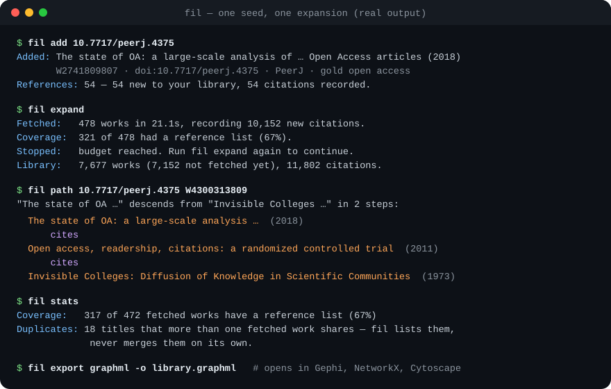
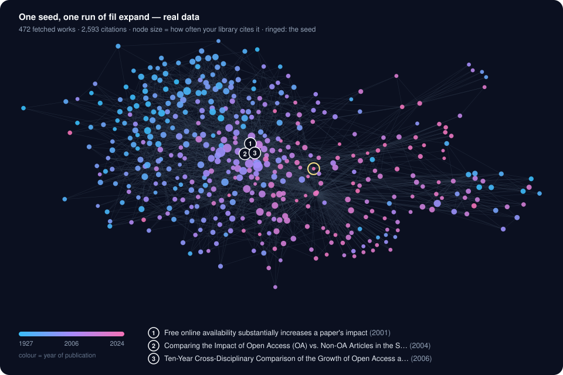
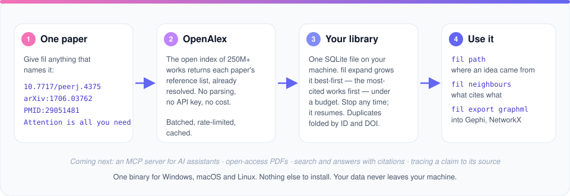

<p align="center">
  
</p>

<h1 align="center">Filiation</h1>

<p align="center">
  <strong>A citation graph you build and keep on your own machine.</strong><br>
  Give it one paper. It follows the references, maps what cites what, and shows you where an idea came from.
</p>

<p align="center">
  <a href="https://github.com/codevector-2003/filiation/releases"></a>
  <a href="LICENSE"></a>
  
  
  
  <a href="https://openalex.org"></a>
</p>

<p align="center">
  <a href="#quick-start">Quick start</a> ·
  <a href="#commands">Commands</a> ·
  <a href="#how-it-works">How it works</a> ·
  <a href="#know-this-before-you-start">Coverage</a> ·
  <a href="#roadmap">Roadmap</a> ·
  <a href="#documentation">Docs</a>
</p>

<p align="center">
  
</p>

---

In textual criticism, **filiation** is the work of establishing which manuscript was copied from which, reconstructing the lines of descent between surviving texts. This tool does the same for research papers. Start from one paper, follow its citations back, and see the literature it grew out of.

Most citation-map tools are session-shaped: you run a query, get a picture, and close the tab. Filiation builds **your** map instead. It keeps growing as you add papers, lives in one file you own, and can be exported to any tool you like.

## Highlights

- 🧭 **Best-first expansion under a budget.** The papers your library cites most are fetched first, so 500 works cover the literature that matters rather than whatever happened to be nearby. Stop at any time; the next run carries on where this one left off.
- 🌳 **Lineage, not just links.** `fil path` finds how one paper descends from another through its references. Citation cycles are real, and the search is safe on them.
- 🧹 **Duplicates handled carefully.** The same paper under two IDs, or a merged record, becomes one node. Papers that only *share a title* are reported for you to judge and never merged automatically: a book review carries the title of the book it reviews.
- 📊 **Honest about the data.** Every run reports how many works came with a reference list, and why that varies by field.
- 📦 **One binary, nothing to install.** A single file for Windows, macOS or Linux. No runtime, no database server, no Docker, no account, no API key.
- 🔒 **Local and legal.** Your library never leaves your machine. Reference data comes from [OpenAlex](https://openalex.org), which is open, and full text will only ever come from open-access sources.

## See it

<p align="center">
  
</p>

<p align="center"><sub>Real output: one run of <code>fil expand</code> from <em>The state of OA</em> (2018), laid out from <code>fil export graphml</code>.<br>The early open-access literature (blue) sits on the left; the recent work around the seed (pink) sits on the right.</sub></p>

## Quick start

### Download

Get the archive for your system from **[Releases](https://github.com/codevector-2003/filiation/releases)**, unpack it, and run `fil`. There is nothing else to install.

| System | Archive |
| --- | --- |
| Windows | `fil_<version>_windows_amd64.zip` (`arm64` also available) |
| macOS (Apple silicon) | `fil_<version>_darwin_arm64.tar.gz` |
| macOS (Intel) | `fil_<version>_darwin_amd64.tar.gz` |
| Linux | `fil_<version>_linux_amd64.tar.gz` (`arm64` also available) |

### Or build from source

```sh
git clone https://github.com/codevector-2003/filiation
cd filiation
go build ./cmd/fil        # Go 1.25 or later. Pure Go, no C compiler needed.
```

### First steps

```sh
fil add 10.7717/peerj.4375                  # a DOI, arXiv ID, PMID, OpenAlex ID, link, or title
fil expand                                  # follow the references, most-cited first
fil path 10.7717/peerj.4375 W4300313809     # how one paper descends from another
fil export graphml -o library.graphml       # open it in Gephi
```

On the first run fil asks where to keep your library. `fil where` shows it at any time.

## Commands

| Command | What it does |
| --- | --- |
| `fil add <paper>` | Add a paper, plus a record for everything it cites. Takes a DOI, arXiv ID, PMID, OpenAlex ID, a link to any of those, or a title. A title can match several papers, so fil lists them and asks; `--accept-first` is for scripts. |
| `fil expand` | Fetch the works your library cites but doesn't have yet, most-cited first. `--max-nodes` (default 500) and `--max-depth` (default 3) bound the run. |
| `fil neighbours <paper>` | What a paper cites, and what in your library cites it. |
| `fil path <a> <b>` | The shortest chain of references from one paper to another. `--any-direction` allows citations either way. |
| `fil stats` | The library at a glance, including reference coverage. `--duplicates` lists works that share a title. |
| `fil export graphml` | The graph as GraphML for Gephi, Cytoscape, yEd, NetworkX or igraph. `--include-stubs` adds works known so far only by ID. |
| `fil where` | Where your library, settings and cache live. |
| `fil cache clear` | Empty the cache of OpenAlex responses. Your library isn't touched. |

Every command has `--help`. Exit codes are distinct per outcome (not found, ambiguous, network, and so on), so scripts can branch on them.

## How it works

<p align="center">
  
</p>

- **References come from OpenAlex, already resolved.** fil never parses reference lists out of PDFs, a process whose errors compound across a graph.
- **Edges before nodes.** A paper's references become records the moment it's fetched. Deduplication is then a primary-key match, and "which unfetched paper matters most?" becomes a cheap count of how often your library cites it.
- **Every batch is one transaction.** Interrupting a run loses at most the batch in flight, and the library is never half-written.
- **Polite to OpenAlex.** Requests are batched 100 works at a time, rate-limited below the measured limit, retried with backoff, and cached.

The design, and the measurements behind it, are written up in [`docs/`](docs).

## Know this before you start

**The graph is only as deep as the reference data behind it, and that depends on your field.** In the [validation run](docs/VALIDATION.md) (20 seed papers across 5 fields, 500 works each), the share of fetched works that came with a reference list was:

| Medicine | Physics | Computer science | Social sciences | Arts & humanities |
| :---: | :---: | :---: | :---: | :---: |
| 93% | 91% | 88% | 59% | 56% |

Where books and chapters dominate, publishers rarely deposit reference lists, and a random humanities sample fares worse still ([spike 4](docs/SPIKES.md)). fil tells you when a work has no references. That's a gap in the data, not a fault in the tool.

## Roadmap

| | Milestone | |
| --- | --- | --- |
| ✅ | **M0: Skeleton.** `fil add`: any identifier to a stored paper and its references | Done |
| ✅ | **M1: The graph.** Budgeted expansion, dedup, `path`, `neighbours`, `stats`, GraphML export, cross-platform release | Done: **v0.1** |
| ⏳ | **M2: MCP server.** Let AI assistants query your library directly | Next |
| ⏳ | **M3: Papers on disk.** Open-access PDFs, full text, and the sentence around each citation | |
| ⏳ | **M4: Retrieval and answers.** Search across everything you've read, answers with citations | |
| ⏳ | **M5: Web interface.** The same library for people who don't use a terminal | |
| ⏳ | **M6: Claim genealogy.** Why each paper cites another, and tracing a claim to its earliest source | |

## Documentation

- [`docs/STATUS.md`](docs/STATUS.md): where the project is, what's done, what's next
- [`docs/ARCHITECTURE.md`](docs/ARCHITECTURE.md): whole-system design
- [`docs/DECISIONS.md`](docs/DECISIONS.md): decisions made, and options rejected, with reasons
- [`docs/SPIKES.md`](docs/SPIKES.md) and [`docs/VALIDATION.md`](docs/VALIDATION.md): measured answers from live data
- [`CLAUDE.md`](CLAUDE.md): working context, hard rules and build order

## Contributing

Issues and pull requests are welcome. Before a larger change, read [`docs/STATUS.md`](docs/STATUS.md) and the hard rules in [`CLAUDE.md`](CLAUDE.md). A few are non-negotiable:

- no cgo;
- no paywalled full text, ever;
- no reference parsing;
- no network access in unit tests.

`go test ./...` runs the whole suite against recorded OpenAlex responses.

## Acknowledgements

Reference data comes from [OpenAlex](https://openalex.org), an open index of the world's research. SQLite runs in pure Go through [`ncruces/go-sqlite3`](https://github.com/ncruces/go-sqlite3). The command line is built with [`spf13/cobra`](https://github.com/spf13/cobra).

## Licence

[Apache License 2.0](LICENSE). Use it, change it, and build on it, including commercially; keep the notices in [`NOTICE`](NOTICE). The licence includes an explicit patent grant from contributors.
